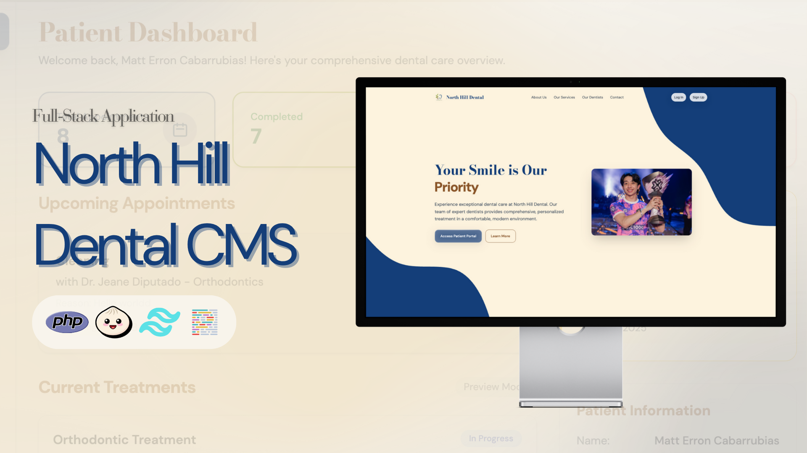

<div align="center">
  

# Dentalign
  
  **A Modern Clinic Management System**
  
  [](https://php.net/)
  [](https://tailwindcss.com/)
  [](https://javascript.com/)
  [](https://mysql.com/)
  [](https://apache.org/)
  
</div>

## 📋 Overview

Dentalign is a comprehensive clinic management system designed specifically for dental practices. Built with modern web technologies and following MVC architecture principles, it provides a streamlined solution for managing appointments, patient records, treatments, and administrative tasks.

## ✨ Features

- **Patient Management**: Complete patient record system with treatment history
- **Appointment Scheduling**: Advanced calendar system with conflict detection
- **Treatment Planning**: Digital dental charts and treatment documentation
- **Payment Processing**: Integrated billing and payment tracking
- **Staff Management**: Role-based access control for different user types
- **Reporting**: Comprehensive analytics and reporting tools
- **Responsive Design**: Mobile-friendly interface built with Tailwind CSS

## 🚀 Tech Stack

### Backend
- **PHP**
- **MySQL**
- **Apache**

### Frontend
- **HTML5/CSS3**
- **Tailwind CSS**
- **JavaScript**

### Development Tools
- **Bun**
- **XAMPP**
- **Git**

## 📦 Installation

### Prerequisites

Before you begin, ensure you have the following installed:
- [XAMPP](https://www.apachefriends.org/download.html) (Apache + MySQL + PHP)
- [Bun](https://bun.sh/) (JavaScript runtime)
- [Git](https://git-scm.com/)

### Getting Started

1. **Clone the repository**
   ```bash
   git clone https://github.com/devliqht/dentalign.git
   cd dentalign
   ```

2. **Install dependencies**
```bash
bun install
```

3. **Set up the database**
   - Start XAMPP and ensure Apache and MySQL services are running
   - Create a new database named `dentalign`
   - Import the SQL file located in `storage/dentalign_070425.sql`

4. **Configure the application**
   - Update database connection settings in `config/DB_Connect.php`
   - Adjust base URL in `config/Base_Url.php` if needed

5. **Start the development server**
```bash
   # Start Tailwind CSS watcher
bun run dev
```

6. **Access the application**
   - Open your browser and navigate to `http://localhost/dentalign`
   - Or use the path where you placed the project in your XAMPP htdocs directory

## 🛠️ Development

### Code Formatting
```bash
bun run prettier
```

### Project Structure
```
dentalign/
├── app/
│   ├── controllers/     # Application controllers
│   ├── models/         # Data models
│   ├── views/          # View templates
│   └── middleware/     # Authentication middleware
├── config/             # Configuration files
├── public/             # Static assets
├── routes/             # Route definitions
└── storage/            # Database files and migrations
```

## 📱 Usage

1. **Login**: Access the system with your credentials
2. **Dashboard**: View overview of appointments and tasks
3. **Patient Management**: Add, edit, and view patient records
4. **Scheduling**: Book and manage appointments
5. **Treatments**: Document dental procedures and treatments
6. **Billing**: Process payments and generate invoices

## 📄 License

This project is licensed under the MIT License - see the [LICENSE](LICENSE) file for details.

